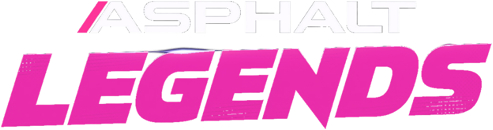
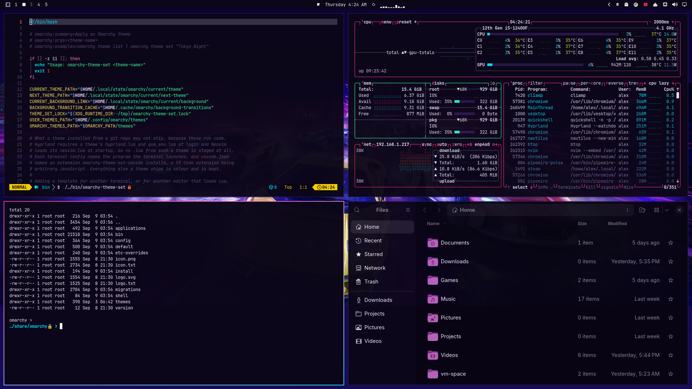
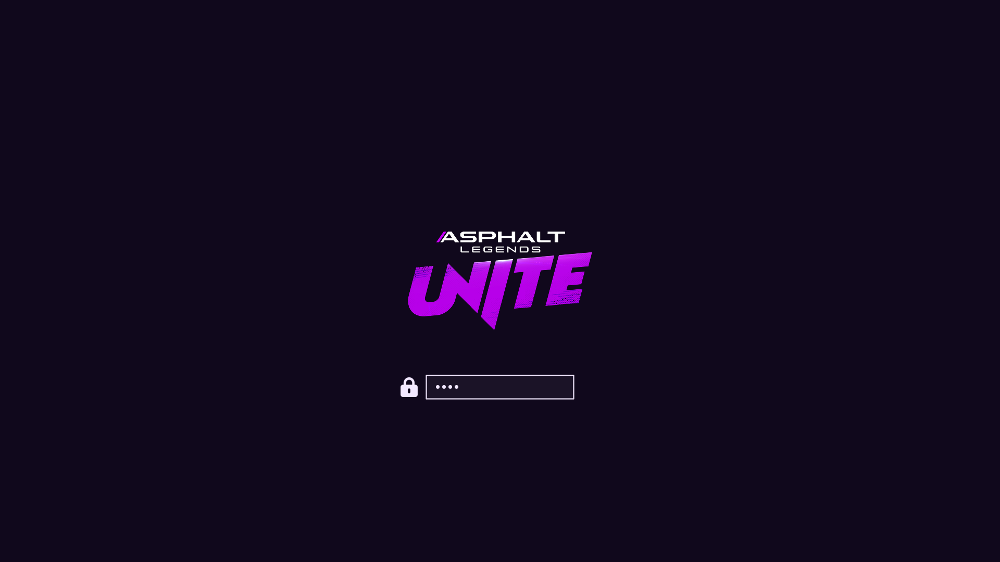
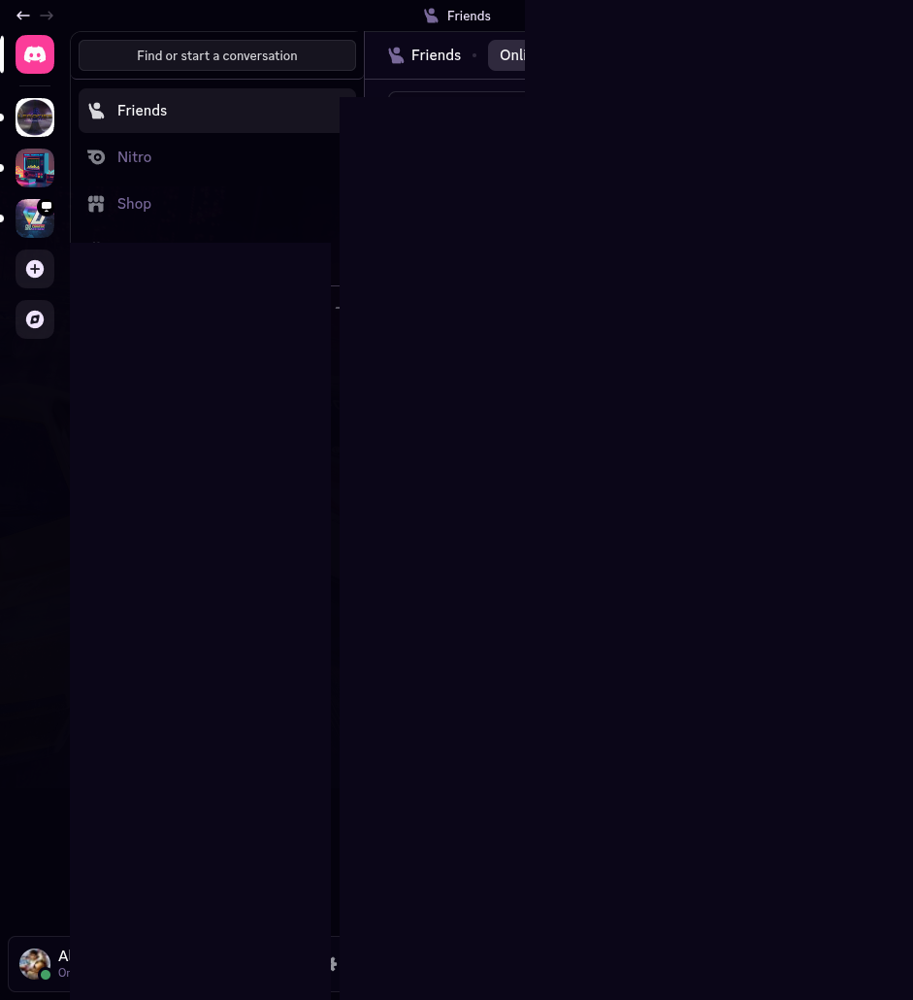

# Asphalt Legends — Omarchy theme

Neon night-pack theme for [Omarchy](https://omarchy.org/): deep purple-black, magenta accent, cyan nitro. Inspired by the look of *Asphalt Legends* — **not affiliated with Gameloft** (see [Credits](#credits--legal-ish) below).

<p align="center">
  
</p>





## Install

```bash
omarchy theme install https://github.com/AlxWolfenstein97/omarchy-asphalt-legends-theme.git
```

That clones **and** applies the theme (`omarchy-theme-set` runs inside
`theme install`). Do **not** follow with another `omarchy theme set` — a second
set skips the first wallpaper and just wastes a switch.

Or clone into place (then you *do* need an explicit set):

```bash
git clone https://github.com/AlxWolfenstein97/omarchy-asphalt-legends-theme.git ~/.config/omarchy/themes/asphalt-legends
omarchy theme set "Asphalt Legends"
```

Cycle wallpapers with `omarchy theme bg next`.

## What’s in the pack

| Asset | Role |
|-------|------|
| `colors.toml` | Palette (the real theme) |
| `backgrounds/` | Wallpapers |
| `unlock.png` / `preview-unlock.png` | Plymouth unlock + picker mockup |
| `preview.png` | Theme switcher preview |
| `icon.txt` / `logo.txt` (+ `about.txt` / `screensaver.txt`) | About & screensaver **ASCII** branding |
| `icon.png` / `logo.png` | Same marks as images (README + optional “Set From Image”) |
| `mangohud.conf.tpl` + `mangohud.theme-set-hook.sample` | Optional HUD tinting |

### Branding (About / screensaver)

**Prefer the `.txt` files.** Copy them into `~/.config/omarchy/branding/` (or paste via Style → About / Screensaver → Edit Text). That’s what you’re meant to see on the TTY-style About screen and the screensaver.

The `.png` versions are here for the README and for a quick Style → **Set From Image** try. In my experience Omarchy’s image→ASCII path is a bit thinicky on color and boxing, so don’t expect magic from the PNGs — the hand/transcoded text is the good path.

### Unlock

Style → Unlock → pick this theme (`unlock.png` / `preview-unlock.png`).

### MangoHud (optional)

**Prefer [OmaHud](https://github.com/AlxWolfenstein97/omahud)** — Style → HUD Themes
retints colour keys only, so Goverlay (or a hand-tuned conf) keeps your metrics,
layout, and Right Shift+F12 hide toggle. Theme-set sync matches the desktop
without the Catppuccin-style “whole file replace” smash.

```sh
omarchy plugin add https://github.com/AlxWolfenstein97/omahud.git --enable
```

#### Legacy: full-file themed template

Still shipped for anyone who wants a stock layout baked into Omarchy’s
`themed/` templates (replaces `MangoHud.conf` on every theme set — smashes
custom Goverlay layouts). Install once from this theme directory:

```bash
bash install-mangohud.sh
```

OmaHud’s installer removes `theme-set.d/mangohud` when present so the two
approaches do not fight. Goverlay’s cube needs a real GPU path; CPU-only nested
VMs staying dark is normal.

## Extend further with plugins

This repo is **palette + assets** on purpose. Omarchy already colour-coordinates the shell, terminals, and editor from `colors.toml`. The plugins below push that idea as far as it can reasonably go — optional extenders, not required theme baggage. Themes keep working without them; authors can stick to the snappier stock pipeline if they prefer.

They do **not** depend on each other. Pick what you want; run the whole inch-a-lada if you want the desktop to feel like yours.

### Why these even exist

Asphalt Legends landed well *inside* Omarchy’s usual theming system — which is exactly what made me look back at how I’d done things on **Archinstall + Hyprland + [Noctalia](https://github.com/noctalia-dev/noctalia-shell) 4.x**. Omarchy 3.x (and even 4.x before you count the shell) only goes so far on purpose; fair enough. After seeing a theme sit this cleanly on stock Omarchy, I wanted to extend that system with some care: standards for when to stop, traps learned the hard way, and something that could go further than the one-palette manual rice I’d had on Noctalia — while still working across **every** `colors.toml` theme. That also makes it more worth doing *more* themes (mine or anyone else’s who finds these): the desktop can follow the palette farther without each theme shipping a private stack.

The [plugin marketplace](https://plugins.omarchy.org/) feels a bit like a game workshop — except you’re not modding a game, you’re modding the *system*. A few of those “just a few things” DHH talked about, until they add up. These extenders should be on the plugins place soon if they’re not already by the time most people see this. I figured someone else would be first to fill some of these gaps; contributing this kind of thing is still fun, and it gave me a reason to try themes and plugins with AI, and to learn what “they run unsandboxed code” actually means by the time we were touching bootloader colours — you *can* touch everything. That’s how you get thousands of plugins in a month: AI and a powerful shell. I picked up a thing or five for whatever Arch (or car) experiment comes next, if ever.

### The big sweep

- **[Chroma](https://github.com/AlxWolfenstein97/chroma)** — GTK3 / GTK4 / libadwaita + Qt in one hook (file manager, Document Viewer, BleachBit, File Roller, qBittorrent, qpwgraph, …). No Style picker: it paints the toolkits most apps already use, not each app by name. Longer “why / where we stop” lives in that README.  
  `omarchy plugin add https://github.com/AlxWolfenstein97/chroma.git --enable`  
  Craft inspiration: [Accord](https://github.com/vonsensey/accord) proved the Omarchy → libadwaita CSS bridge; Chroma is the extender this theme points people at.

### One-surface Style plugins (palette previews + apply)

These sync from `colors.toml` across **every** installed theme (stock, user, foreign). Several ship a Style carousel so you can preview the same surface across all your themes faster than flipping by hand — even when `theme-set` already keeps them in lockstep.

| Plugin | What it themes |
|--------|----------------|
| **[OmaOBS](https://github.com/AlxWolfenstein97/omaobs)** | OBS Studio (real Yami `Omarchy.ovt`) |
| **[OmaCursor](https://github.com/AlxWolfenstein97/omacursor)** | Pointer / Adwaita XCursor recolor (+ optional SDDM) |
| **[OmaHud](https://github.com/AlxWolfenstein97/omahud)** | MangoHud colours only (Goverlay keeps metrics/layout) |
| **[OmaBoot](https://github.com/AlxWolfenstein97/omaboot)** | Limine boot menu colours |
| **[OmaVT](https://github.com/AlxWolfenstein97/omavt)** | Virtual console / TTY palette |
| **[OmaTTY](https://github.com/AlxWolfenstein97/omatty)** | Console font (Terminus-first, accessibility) |

```bash
omarchy plugin add https://github.com/AlxWolfenstein97/omaobs.git --enable
omarchy plugin add https://github.com/AlxWolfenstein97/omacursor.git --enable
omarchy plugin add https://github.com/AlxWolfenstein97/omahud.git --enable
omarchy plugin add https://github.com/AlxWolfenstein97/omaboot.git --enable
omarchy plugin add https://github.com/AlxWolfenstein97/omavt.git --enable
omarchy plugin add https://github.com/AlxWolfenstein97/omatty.git --enable
```

### Already solved elsewhere (gladly)

- **[Omacord](https://github.com/ASwenia/omacord)** — Vesktop / Vencord Discord follows Omarchy themes live. I did not have to extend the whole theming system for chat myself:  
  `omarchy plugin add https://github.com/ASwenia/omacord --enable`

Omacord on Vesktop with this theme (DMs / names redacted):



### Agent / desktop bridge

- **[OMCP](https://github.com/btsouth/omarchy-omcp)** — MCP desktop bridge (themes, windows, apps, …). Made iterating this theme a lot easier; screenshots sometimes need the agent’s session env wired up depending on the client (Claude-first, others optional). Not my project to patch — credit stays either way:  
  `omarchy plugin add https://github.com/btsouth/omarchy-omcp --enable`

Browse more on the [Omarchy Plugins](https://plugins.omarchy.org/) site.

**Honest stop-line:** these extenders only chase places that accept colour data (or a clean conversion). Websites, Steam chrome, document paper in LibreOffice, and similar “own paint engine / remote CSS” surfaces are out of scope on purpose — documented in Chroma’s README. Unthemed beats a half-assed chase.

## Taste

Colours and contrast are tuned for what I like to look at. If they feel loud or wrong for you, fork and retune `colors.toml` without guilt. (Console font sizing for low vision lives in [OmaTTY](https://github.com/AlxWolfenstein97/omatty), not this theme.)

## Credits / legal-ish

- Visual inspiration and reference art from **Gameloft**’s *Asphalt* / *Asphalt Legends* branding and marketing. **Not affiliated with, endorsed by, or sponsored by Gameloft.** Just public pixels arranged into an Omarchy theme — no money, no official product.
- If Gameloft hates this existing, they can say so and I’ll deal with the repo accordingly.
- Theming extenders grew out of time on Archinstall + Hyprland + [Noctalia](https://github.com/noctalia-dev/noctalia-shell) (excellent engine — credit), then got rebuilt as optional Omarchy plugins once 4.x made agentic molding feel real. Cliamp’s Omarchy-themed radio did not hurt the mood either.

## License

Do whatever you want with this theme pack unless Gameloft (or the law) says otherwise. Fork it, recolor it, ship it in a rice. No warranty — it’s wallpaper and hex codes.
