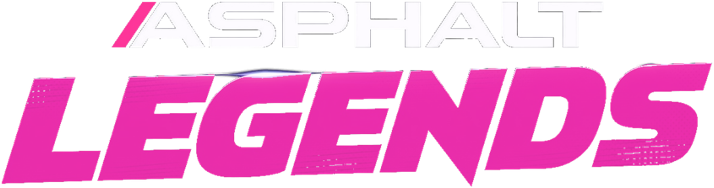
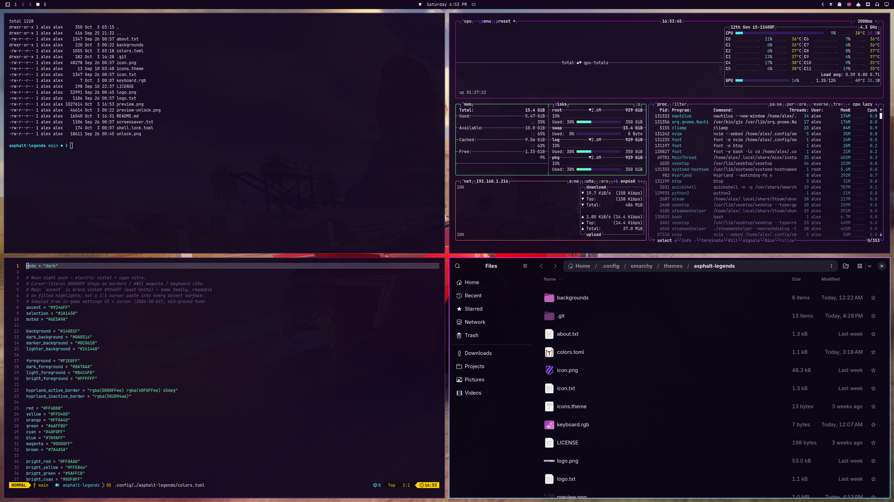
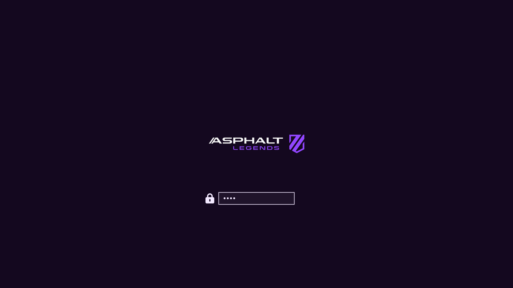

# Asphalt Legends — Omarchy theme

Remember the races? The hyprdrive? TouchDrive, even? Maybe not so much the
microtransactions. What if your desktop felt like you’re quirk-screwing and
nitro-boosting through that neon-drenched night pack — in-game violet chrome
(`#D000FF` cursor on borders / keyboard, brand `#9246FF` on toolkit accents),
cyan nitro streaks, purple-black asphalt under the wheels — instead of another
flat dark mode that could belong to anyone? Hyprland’s active border runs the
same dual-accent trick as HEV, Galuga, CS, Cyber Shadow, Doom 2016, Eternal,
Caged, KI, Rising, Stanley, SF6, T2D & USFIV: **violet → cyan** at 45°.

Neon night-pack theme for [Omarchy](https://omarchy.org/). Inspired by the look
of *Asphalt Legends* — **not affiliated with Gameloft** (see
[Credits](#credits--legal-ish) below). See
[Closer than we started](#closer-than-we-started) for how the hexes were
pulled and why `accent` is not a 1:1 cursor paste.

<p align="center">
  
</p>





Also in this series:
[HEV Suit](https://github.com/AlxWolfenstein97/omarchy-hev-suit-theme),
[Operation Galuga](https://github.com/AlxWolfenstein97/omarchy-operation-galuga-theme),
[Counter-Strike](https://github.com/AlxWolfenstein97/omarchy-counter-strike-theme),
[Cyber Shadow](https://github.com/AlxWolfenstein97/omarchy-cyber-shadow-theme),
[Doom 2016](https://github.com/AlxWolfenstein97/omarchy-doom-2016-theme),
[Doom Eternal](https://github.com/AlxWolfenstein97/omarchy-doom-eternal-theme),
[Half-Life Caged](https://github.com/AlxWolfenstein97/omarchy-half-life-caged-theme),
[Killer Instinct](https://github.com/AlxWolfenstein97/omarchy-killer-instinct-theme),
[Metal Gear Rising](https://github.com/AlxWolfenstein97/omarchy-metal-gear-rising-theme),
[Stanley Parable](https://github.com/AlxWolfenstein97/omarchy-stanley-parable-theme),
[Street Fighter 6](https://github.com/AlxWolfenstein97/omarchy-street-fighter-6-theme),
[Terminator 2D: NO FATE](https://github.com/AlxWolfenstein97/omarchy-terminator-2d-no-fate-theme),
and
[Ultra Street Fighter IV](https://github.com/AlxWolfenstein97/omarchy-ultra-street-fighter-iv-theme).

## Install

```bash
omarchy theme install https://github.com/AlxWolfenstein97/omarchy-asphalt-legends-theme.git
# optional — About + screensaver ASCII for this theme (skippable; see Branding)
cp ~/.config/omarchy/themes/asphalt-legends/about.txt ~/.config/omarchy/branding/about.txt
cp ~/.config/omarchy/themes/asphalt-legends/screensaver.txt ~/.config/omarchy/branding/screensaver.txt
```

That clones **and** applies the theme (`omarchy-theme-set` runs inside
`theme install`). Do **not** follow with another `omarchy theme set` — a second
set skips the first wallpaper and just wastes a switch.

Or clone into place (then you *do* need an explicit set):

```bash
git clone https://github.com/AlxWolfenstein97/omarchy-asphalt-legends-theme.git ~/.config/omarchy/themes/asphalt-legends
omarchy theme set "Asphalt Legends"
# optional branding — same as above
cp ~/.config/omarchy/themes/asphalt-legends/about.txt ~/.config/omarchy/branding/about.txt
cp ~/.config/omarchy/themes/asphalt-legends/screensaver.txt ~/.config/omarchy/branding/screensaver.txt
```

Already installed and just switching back later:

```bash
omarchy theme set "Asphalt Legends"
# optional — re-apply this theme’s About / screensaver marks
cp ~/.config/omarchy/themes/asphalt-legends/about.txt ~/.config/omarchy/branding/about.txt
cp ~/.config/omarchy/themes/asphalt-legends/screensaver.txt ~/.config/omarchy/branding/screensaver.txt
```

Cycle wallpapers with `omarchy theme bg next`.

## What’s in the pack

| Asset | Role |
|-------|------|
| `colors.toml` | Palette (the real theme) |
| `backgrounds/` | Wallpapers |
| `unlock.png` / `preview-unlock.png` | Plymouth unlock + picker mockup |
| `preview.png` | Theme switcher preview |
| `icon.txt` / `logo.txt` (+ `about.txt` / `screensaver.txt`) | About & screensaver **ASCII** branding |
| `icon.png` / `logo.png` | Same marks as images (README + optional “Set From Image”) |

### Branding (About / screensaver)

**Optional.** Omarchy’s About screen and screensaver read from
`~/.config/omarchy/branding/`. Shipping per-theme `.txt` marks isn’t original —
other Omarchy 3.x themes did it — but it’s the fast path if you want *this*
pack’s wordmark on idle and on About without hunting files.

**Prefer the `.txt` files** and the `cp` lines in [Install](#install). That’s
what you’re meant to see. Editing the text also works (Style → About /
Screensaver → Edit Text).

**Skip the `cp` if you already have custom logos / screensaver art you care
about** — or back those up first. The branding slot is really meant for *your*
marks (put personal art somewhere easy to reach). The Style file picker works,
but drilling into `~/.config/omarchy/themes/...` is slow busywork for something
optional. Don’t feel obliged to bring mine.

The `.png` versions are here for the README and for a quick Style → **Set From
Image** try. In my experience Omarchy’s image→ASCII path is a bit thinicky on
color and boxing, so don’t expect magic from the PNGs — the hand text is the
good path.

Screensaver / logo ASCII follows the current site wordmark proportions —
**ASPHALT** over **LEGENDS**, with the AL shield on the right (no empty lines).
About / icon is the funky AL shield alone (same silhouette as `icon.png`).

### Unlock

Style → Unlock → pick this theme (`unlock.png` / `preview-unlock.png`).

## Extend further with plugins

This repo is **palette + assets** on purpose. Omarchy already colour-coordinates
the shell, terminals, and editor from `colors.toml`. The plugins below push that
idea as far as it can reasonably go — optional extenders, not required theme
baggage. Themes keep working without them; authors can stick to the snappier
stock pipeline if they prefer.

They do **not** depend on each other. Pick what you want; run the whole
inch-a-lada if you want the desktop to feel like yours.

### Why these even exist

Asphalt Legends landed well *inside* Omarchy’s usual theming system — which is
exactly what made me look back at how I’d done things on **Archinstall +
Hyprland + [Noctalia](https://github.com/noctalia-dev/noctalia-shell) 4.x**.
Omarchy 3.x (and even 4.x before you count the shell) only goes so far on
purpose; fair enough. After seeing a theme sit this cleanly on stock Omarchy, I
wanted to extend that system with some care: standards for when to stop, traps
learned the hard way, and something that could go further than the one-palette
manual rice I’d had on Noctalia — while still working across **every**
`colors.toml` theme. That also makes it more worth doing *more* themes (mine or
anyone else’s who finds these): the desktop can follow the palette farther
without each theme shipping a private stack. Build one good theme, build good
extenders, build more good themes that work as a base *and* with the
extenders — then circle back. Not an accident.

The [plugin marketplace](https://plugins.omarchy.org/) feels a bit like a game
workshop — except you’re not modding a game, you’re modding the *system*. A few
of those “just a few things” DHH talked about, until they add up. These
extenders should be on the plugins place soon if they’re not already by the time
most people see this. I figured someone else would be first to fill some of
these gaps; contributing this kind of thing is still fun, and it gave me a
reason to try themes and plugins with AI, and to learn what “they run
unsandboxed code” actually means by the time we were touching bootloader
colours — you *can* touch everything. That’s how you get thousands of plugins
in a month: AI and a powerful shell. I picked up a thing or five for whatever
Arch (or car) experiment comes next, if ever.

### The big sweep

- **[Chroma](https://github.com/AlxWolfenstein97/chroma)** — GTK3 / GTK4 /
  libadwaita + Qt in one hook (file manager, Document Viewer, BleachBit, File
  Roller, qBittorrent, qpwgraph, …). No Style picker: it paints the toolkits
  most apps already use, not each app by name. Longer “why / where we stop”
  lives in that README. Craft inspiration:
  [Accord](https://github.com/vonsensey/accord) proved the Omarchy → libadwaita
  CSS bridge; Chroma is the extender this theme points people at.

### One-surface Style plugins (palette previews + apply)

These sync from `colors.toml` across **every** installed theme (stock, user,
foreign). Several ship a Style carousel so you can preview the same surface
across all your themes faster than flipping by hand — even when `theme-set`
already keeps them in lockstep.

| Plugin | What it themes |
|--------|----------------|
| **[OmaOBS](https://github.com/AlxWolfenstein97/omaobs)** | OBS Studio (real Yami `Omarchy.ovt`) |
| **[OmaCursor](https://github.com/AlxWolfenstein97/omacursor)** | Pointer / Adwaita XCursor recolor (+ optional SDDM) |
| **[OmaHud](https://github.com/AlxWolfenstein97/omahud)** | MangoHud colours only — live in-game retint; Goverlay keeps metrics/layout |
| **[OmaBoot](https://github.com/AlxWolfenstein97/omaboot)** | Limine boot menu colours |
| **[OmaVT](https://github.com/AlxWolfenstein97/omavt)** | Virtual console / TTY palette |
| **[OmaTTY](https://github.com/AlxWolfenstein97/omatty)** | Console font (Terminus-first, accessibility) |

**Boom-in — one paste.** `--enable --yes` skips the per-plugin clone/enable
prompts; arm-all then arms deps + Style/theme-set + root/SDDM/DRM (no Y/n).
Omit any `plugin add` line you do not want; arm-all only touches what is
installed. Sudo may ask once — that is the boom, not a menu.

```bash
omarchy plugin add https://github.com/AlxWolfenstein97/chroma.git --enable --yes
omarchy plugin add https://github.com/AlxWolfenstein97/omaobs.git --enable --yes
omarchy plugin add https://github.com/AlxWolfenstein97/omacursor.git --enable --yes
omarchy plugin add https://github.com/AlxWolfenstein97/omahud.git --enable --yes
omarchy plugin add https://github.com/AlxWolfenstein97/omaboot.git --enable --yes
omarchy plugin add https://github.com/AlxWolfenstein97/omavt.git --enable --yes
omarchy plugin add https://github.com/AlxWolfenstein97/omatty.git --enable --yes
~/.config/omarchy/plugins/io.github.alxwolfenstein97.chroma/tools/arm-all-family.sh
```

**Boom-out — one paste.** Teardown + ledger pkg drop + plugin remove.
Ledger drops only what we recorded pulling; may fail and stay if something else
still needs the package (e.g. Goverlay after Pillow) — fine. Loud boom-in after
this is enough — no tombstone purge needed (optional OCD flag lives on the
plugin READMEs).

```bash
~/.config/omarchy/plugins/io.github.alxwolfenstein97.chroma/tools/wipe-all-family.sh
```

**Piece-meal** (not boom): one plugin’s Workshop paste — `plugin add` + interactive
`install.sh` (asks [Y/n]) — lives on that plugin’s GitHub README. Single-plugin
full wipe: `…/<plugin>/uninstall.sh --yes`.


### Already solved elsewhere (gladly)

- **[Omacord](https://github.com/ASwenia/omacord)** — Vesktop / Vencord Discord
  follows Omarchy themes live. No theme carousel / mockup picker: it **syncs**,
  and that’s the right call. Chat mockups are content-shaped anyway — you
  censor half the shot and still aren’t showing a true layout. I did not have
  to extend the whole theming system for chat myself:  
  `omarchy plugin add https://github.com/ASwenia/omacord --enable`

### Agent / desktop bridge

- **[OMCP](https://github.com/btsouth/omarchy-omcp)** — MCP desktop bridge
  (themes, windows, apps, …). Made iterating this theme a lot easier;
  screenshots sometimes need the agent’s session env wired up depending on the
  client (Claude-first, others optional). Not my project to patch — credit stays
  either way:  
  `omarchy plugin add https://github.com/btsouth/omarchy-omcp --enable`

Browse more on the [Omarchy Plugins](https://plugins.omarchy.org/) site.

**Honest stop-line:** these extenders only chase places that accept colour data
(or a clean conversion). Websites, Steam chrome, document paper in LibreOffice,
and similar “own paint engine / remote CSS” surfaces are out of scope on purpose
— documented in Chroma’s README. Unthemed beats a half-assed chase.

## Closer than we started

Refine pass (2026-10): sample the live UI, then split loud chrome from filled
toolkit accents so Qt menus / GTK selection fills stay readable at a glance.

1. **Cursor-literal punch** — Settings + account-linking screenshots with the
   in-game mouse cursor visible. Dominant neon pixel cluster lands on
   `#D000FF` (old brand note `#C800FE`; logo “LEGENDS” stays softer on the
   wordmark). Preview check: Omarchy/Adwaita pointer on top of the in-game
   cursor — same hue, different shape. That hex stays on `magenta`,
   `keyboard.rgb`, lock `border-active`, and the first stop of the Hyprland
   dual border — places that are outlines / LEDs, not big text-on-fill
   surfaces.
2. **Toolkit `accent`** — Pure `#D000FF` as Chroma/Qt/GTK `accent` blows out
   menu highlights and Disks partition selection (works if you squint, fails
   at a glance). `accent` is therefore brand violet `#9246FF` (post-Unite
   main) — same family as the cursor, closer than the old pink `#FF52B0`,
   not a literal pixel paste into every filled control.
3. **UI void** — Dark purple menu backgrounds (~`#180A2C`) and header bar
   (~`#502094`) nudge `background` / `lighter_background` /
   `hyprland_inactive_border`. Shop yellow `#FFD400` updates `yellow`.
4. **Cyan nitro** — Keep electric `#40F0FF` as the second border stop (light
   trails / neon pack), not the flatter currency-token azure.
5. **Walls** — Empty Brooklyn POV wall swapped for Gameloft’s clean loading
   **key art** (`backgrounds/3-bridge-keyart.jpg`, same composition as the
   in-game loading screen, no player-ID / ratings chrome). Coastal ram stays
   as `#4`. Freecam race shots skipped — Asphalt watermarks the freecam view.
6. **Unlock mock** — `preview-unlock.png` regenerated the usual Omarchy way:
   `background` + `foreground` Plymouth assets composited with site
   `unlock.png` (pass field is foreground, not accent — matches real
   `omarchy-plymouth-set`).

Race freecam is a no-go for walls while the watermark is there; menu / loading
/ official CDN art is the clean lane.

## Taste

Anchored on in-game samples, then tuned so filled accents don’t eat labels.
If they feel loud or wrong for you, fork and retune `colors.toml` without
guilt. (Console font sizing for low vision lives in
[OmaTTY](https://github.com/AlxWolfenstein97/omatty), not this theme.)

## Credits / legal-ish

- Visual inspiration and reference art from **Gameloft**’s *Asphalt* / *Asphalt
  Legends* branding and marketing. **Not affiliated with, endorsed by, or
  sponsored by Gameloft.** Just public pixels arranged into an Omarchy theme —
  no money, no official product.
- Official site wordmark ([asphaltlegends.com](https://asphaltlegends.com/))
  supplies `unlock.png` / `logo.png` / Plymouth preview.
- Loading key art wall from the official site CDN
  (`Banner_Key_Art_Shadow` on `asphalt9.assets.gameloft.com`).
- Palette refine sampled from local in-game Settings / Gameloft Connect UI
  screenshots (cursor + chrome), not from a third-party theme pack.
- If Gameloft hates this existing, they can say so and I’ll deal with the repo
  accordingly.
- Theming extenders grew out of time on Archinstall + Hyprland +
  [Noctalia](https://github.com/noctalia-dev/noctalia-shell) (excellent engine —
  credit), then got rebuilt as optional Omarchy plugins once 4.x made agentic
  molding feel real. Cliamp’s Omarchy-themed radio did not hurt the mood either.

## License

Do whatever you want with this theme pack unless Gameloft (or the law) says
otherwise. Fork it, recolor it, ship it in a rice. No warranty — it’s wallpaper
and hex codes.
